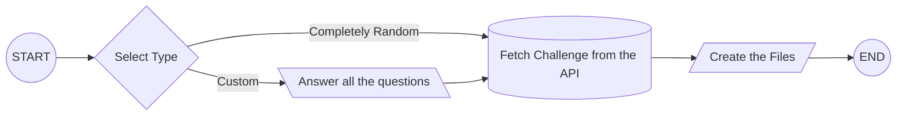

# Coding Challenge Generator

[](https://badge.fury.io/js/@roeeyn%2Fchallenge-generator?branch=master&kill_cache=1)


<!-- START doctoc generated TOC please keep comment here to allow auto update -->
<!-- DON'T EDIT THIS SECTION, INSTEAD RE-RUN doctoc TO UPDATE -->
**Table of Contents**

- [Getting Started](#getting-started)
  - [To get general help](#to-get-general-help)
  - [Generate a coding challenge selecting each parameter](#generate-a-coding-challenge-selecting-each-parameter)
  - [Generate a `python3` coding challenge](#generate-a-python3-coding-challenge)
  - [Generate a `javascript` coding challenge](#generate-a-javascript-coding-challenge)
  - [Generate a `java` coding challenge](#generate-a-java-coding-challenge)
- [Coding Challenge Contents](#coding-challenge-contents)
  - [README File](#readme-file)
  - [Index File](#index-file)
  - [Test File](#test-file)
  - [Test Framework File](#test-framework-file)
  - [Run File](#run-file)
- [Advanced Usage](#advanced-usage)
- [Judge0 Submission](#judge0-submission)
- [Future Roadmap](#future-roadmap)

<!-- END doctoc generated TOC please keep comment here to allow auto update -->

This CLI generates a challenge folder based on the [challenge-generator-backend API](https://github.com/roeeyn/challenge-generator-backend). The content of the folder is described in the [challenge content](#challenge-contents) section.

The usual flow is the following:



## Getting Started

For further customization, go to the [Advanced Usage](#advanced-usage) section.
If you want to take a look at the modules documentation, click [here](https://roeeyn.github.io/challenge-generator/).

### To get general help

```bash
npx @roeeyn/challenge-generator --help
```

### Generate a coding challenge selecting each parameter

```bash
# To skip a parameter just press Enter
npx @roeeyn/challenge-generator
```

### Generate a `python3` coding challenge

```bash
npx @roeeyn/challenge-generator --programming-language python3 -s
```

### Generate a `javascript` coding challenge

```bash
npx @roeeyn/challenge-generator --programming-language javascript -s
```

### Generate a `java` coding challenge

> :warning: Even if we can create a challenge for Java, we haven't tested it yet on Jude0 so the submission tools may not work correctly as the testframework and run file are not yet implemented.

```bash
npx @roeeyn/challenge-generator --programming-language java -s
```

## Coding Challenge Contents

The created coding challenge folder contains the following files:

- [README File](#readme-file)
- [Index File](#index-file)
- [Test File](#test-file)
- [Test Framework File](#test-framework-file)
- [Run File](#run-file)

### README File

This is the file which contains the coding challenge description, and some of the examples provided. This is usually provided as a markdown file, so the formatted is done automatically.

### Index File

The index file contains the initial function of the coding challenge, which should be given to the user directly.

### Test File

This is the file which contains all the unit tests for the coding challenge. This usually make use of the custom testing framework provided, but see the [Test Framework File](#test-framework-file) for the details.

### Test Framework File

This file contains our **minified** custom testing framework, to validate that the code uploaded from the user is correct. To see the original framework, see the [templates](src/templates/) folder.

> :warning: We have include the most used functions, but there are coding challenges that contains specific testing for that specific coding challenge and our test framework may not work on that. **This is not usual**, though.

### Run File

This file contains the execution script to run whenever this coding challenge is uploaded to Judge0.

## Advanced Usage

We can filter most of the params we want the coding challenge to contain. These are the following:

| Flag                    | Requires Value? | Description                                                                                   | Example                                  |
| ----------------------- | :-------------: | --------------------------------------------------------------------------------------------- | ---------------------------------------- |
| -V, --version           |       ❌        | Prints the CLI version                                                                        | `0.0.1`                                  |
| -t, --title             |       ✅        | Title regex to search                                                                         | `ort$` e.g. Titles which ends with 'ort' |
| --edabit-id             |       ✅        | If you know the value of the edabit id, you can set it directly                               | `6vSZmN66xhMRDX8YT`                      |
| -a, --author            |       ✅        | Author regex to search                                                                        | `^M` e.g Author which starts with 'M'    |
| -t, --tags              |       ✅        | Tags to serch separated by commas                                                             | `strings,loops`                          |
| -d, --min-difficulty    |       ✅        | The minimum difficulty the challenge should have from 0 (easiest) to 5 (hardest)              | `2.5`                                    |
| -q, --min-quality       |       ✅        | The minimum quality the challenge should have from 0 (lowest) to 5 (highest)                  | `2.5`                                    |
| --programming-language  |       ✅        | The challenge programming language. Only `java`, `javascript`, and `python3` is supported.    | `javascript`                             |
| -s, --skip-confirmation |       ❌        | If the confirmation message should be skipped, and if the other parametrs should be discarded | N/A                                      |
| -v, --verbose           |       ❌        | Prints debugging information                                                                  | N/A                                      |
| -h, --help              |       ❌        | Prints this information                                                                       | N/A                                      |

## Judge0 Submission

We created a script ([judge0-submissioner](examples/judge0-submissioner.sh)) that can help you testing the submissions into judge0 easily, you can find it in the [examples](examples/) folder. The basic usage of this script is the following:

```bash
# Maybe you need to give execution access
chmod +x ./examples/judge0-submissioner.sh

# Set the judge0 token (auth, not user)
export JUDGE0_AUTH_TOKEN='YOUR_AUTH_TOKEN'

# Submit the coding challenge solution and the extension (py or js)
./examples/judge0-submissioner.sh your_challenge_directory your_lang_extension

# Real example
./examples/judge0-submissioner.sh ./challenge-proper-modulo-operator js
```

## Future Roadmap

- Improve Judge0 submissioner to a better CLI.
- Warn the user if some unexpected element is present in the tests.
