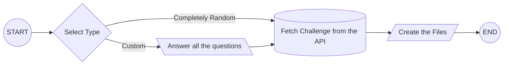

# Challenge Generator

We should have three files at least:

- Index File
- Test File
- README
- run (only for Judge0)

## Index File

Example:

```javascript
function hello() {
  //Escribe aquí tu solución
}

module.exports = hello;
```

## Test File

Example:

```javascript
const hello = require("./index");

function test(title, callback) {
  try {
    callback();
  } catch (error) {
    console.log("Falló " + title + "...");
    throw new Error(error);
  }
}

function expect(result) {
  return {
    toBe(expected) {
      if (result !== expected) {
        throw new Error({
          message: `expected ${expected} but result is ${result}`,
        });
      }
    },
  };
}

test("Test", () => {
  const result = hello();
  const expected = "Hola mundo!";
  expect(result).toBe(expected);
});
```

## README File

Example:

```md
## PASOS PARA RESOLVER EL EJERCICIO 🚀

- Escribe tu solución en la función del archivo index.js
- Ejecuta los test con `node test.js`
```

## Run File (only for Judge0)

Example:

```bash
node test.js
```

## Ideas about the flow


