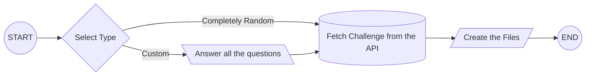

# Challenge Generator

This is WIP

## Ideas about the flow

```mermaid
graph LR
    A((START)) --> B{Select Type}
    B --> |Custom| E[\Answer all the questions\]
    B --> |Completely Random| F[(Fetch Challenge from the API)]
    E --> F
    F --> G[/Create the Files/]
    G --> H((END))
```
